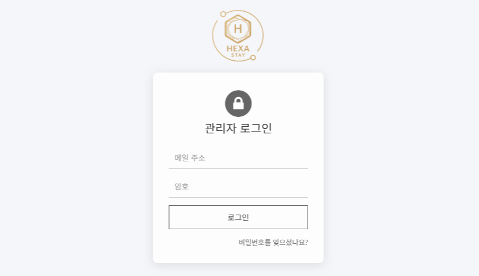

<!-- Hero -->

  <h1>김뿌뿌뿌 · Backend & RPA & CV Engineer</h1>
  
Spring Boot · Thymeleaf · MariaDB · ModelMapper · YOLOv11 · OpenCV · UiPath · AWS

  

    <a href="README_en.md">English</a> ·
    <a href="mailto:you@example.com">Email</a> ·
    <a href="https://www.linkedin.com/in/your-id">LinkedIn</a>
  

<!-- 빈 줄 하나 아래에도 둬야 함 -->

---

## 👋 10초 요약
- **호텔 관리 생태계(HexaStay)**를 Spring Boot 3.4 + Thymeleaf + MariaDB로 구축/확장.
- **QR 인증·이메일 발송·ModelMapper·Principal** 기반의 안정적인 백엔드 CRUD와 고급 **관리자 대시보드(UI/UX)** 설계.
- **YOLO + OpenCV**로 CCTV Vision AI 대시보드(영역 경보, 실시간 차트, 반응형 UI) 구현.
- **UiPath RPA**로 대용량 텍스트 요약/정리 파이프라인 구축(Invoke Code, JSON 파싱, Excel 출력 자동화).

---

## 🏆 대표 프로젝트 (Featured)
> 클릭 한 번에 “문제 → 접근 → 성과 → 기술 스택”이 보이도록 구성했습니다. 더 자세한 내용은 **케이스 스터디**로 연결됩니다.

### 1) HexaStay Admin – 호텔 관리 대시보드
**Stack:** Spring Boot 3.4, JDK 21, Thymeleaf, Bootstrap 5, MariaDB, ModelMapper, AWS  
**핵심 기능:**  
- 객실/회원/예약 모듈, **QR 인증** & **이메일 발송**(예약 생성 시 자동 본문 구성: 회원명/체크인·아웃/룸비번/QR 링크)  
- 룸 상태별 리스트(체크인/체크아웃/표시/숨김) 필터, **공통 roomlist.html 재사용**  
- **모달 기반** 검색/수정(HotelRoom 이미지/메타 포함), @Query + Service(ModelMapper) + JSON 응답  

**성과(예시):**  
- 운영 인력의 수작업을 줄이고, 예약/수정/알림의 **단계 시간을 단축**  
- 단일 페이지 재사용 구조로 **프론트 유지보수성** 향상

[자세히 보기 →](docs/hexastay-admin.md)  

---

### 2) CCTV Vision AI Dashboard
**Stack:** Python, Ultralytics YOLOv11, OpenCV, Flask/Socket.IO(또는 Streamlit), JS/Canvas  
**핵심 기능:**  
- 폴리곤 **Region** 기반 침입 카운팅, 실시간 경보(색상 단계: ALERT/WARN/SAFE/IDLE)  
- 반응형 UI + **실시간 그래프/차트** + **4칸 경보 패널**  
- 좌표 정규화, YOLO 결과 처리 함수화(테스트/확장 용이)

**성과(예시):**  
- 한 화면에서 **상황 인지** 및 **의사결정 속도** 개선  
- 영역 단위 경보로 **오탐/미탐 피드백 루프** 구축

[자세히 보기 →](docs/cctv-vision-dashboard.md)  

---

### 3) UiPath 리뷰 요약 자동화 파이프라인
**Stack:** UiPath, VB.NET Invoke Code, Newtonsoft JSON, Excel Activities  
**핵심 기능:**  
- Blind 리뷰 텍스트 → **긍/부정/결론** 3단 요약, **Dt_Blind_Ai_Result** 스키마 자동 구성  
- `choices[0].message.content`/`text` 안전 파싱, **MaxLength=-1** 처리, 오류 시 `Decision`에 JSON 기록  
- 대량 리뷰 입력 → **Excel 자동 출력**(WrapText, 열 너비 조정)

**성과(예시):**  
- 분석 리드타임 **단축** / 사내 리포팅 **반자동화**  
- 프롬프트 프리셋 & 파이프라인 표준화

[자세히 보기 →](docs/uipath-blind-review-pipeline.md)  

---

### 4) Excel → MariaDB “스키마 없이” 바로 저장
**Stack:** Spring Boot, Apache POI(or EasyExcel), JDBC, MariaDB  
**핵심 기능:**  
- Excel 업로드 → **테이블명 입력 → 존재 시 덮어쓰기 / 미존재 시 생성**  
- **PK 타입 선택(INT/LONG)**, 첫 컬럼 자동 변환, 예외 메시지 UI 반영  
- Controller → Service 분리, 알림/실패 시나리오 명확화

**성과(예시):**  
- 비개발자도 **데이터 적재** 가능 / 샌드박스 테이블로 도메인 실험 가속

[자세히 보기 →](docs/excel-to-mariadb-importer.md)  

---

## 🧰 기술 스택
**Backend:** Spring Boot 3.4, JDK 21, Thymeleaf, ModelMapper, JPA, MariaDB, AWS  
**Vision/ML:** Ultralytics YOLOv5–v11, OpenCV, (Streamlit/Flask/Socket.IO)  
**RPA:** UiPath, VB.NET Invoke Code, Newtonsoft JSON, Excel Activities  
**Frontend:** Bootstrap 5, HTML5/CSS3/JS, jQuery/Ajax/Fetch  
**DevOps/Etc:** IntelliJ, GitHub, HeidiSQL, MobaXterm

---

## 🧭 설계 & 문서화
- **아키텍처/시퀀스/ERD**를 케이스 스터디에 포함  
- 공통 규칙: Principal 사용, ModelMapper 패턴, 로그 형식, CRUD 네이밍, 가독성 우선  
- 예외 메시지는 **UI까지 전달**(사용자 가시성)

---

## 📄 링크 & 연락
- Email: youremail@example.com  
- GitHub: https://github.com/your-id  
- LinkedIn: https://www.linkedin.com/in/your-id  
- Resume: [KR PDF](assets/Resume_KR.pdf) · [EN PDF](assets/Resume_EN.pdf)
