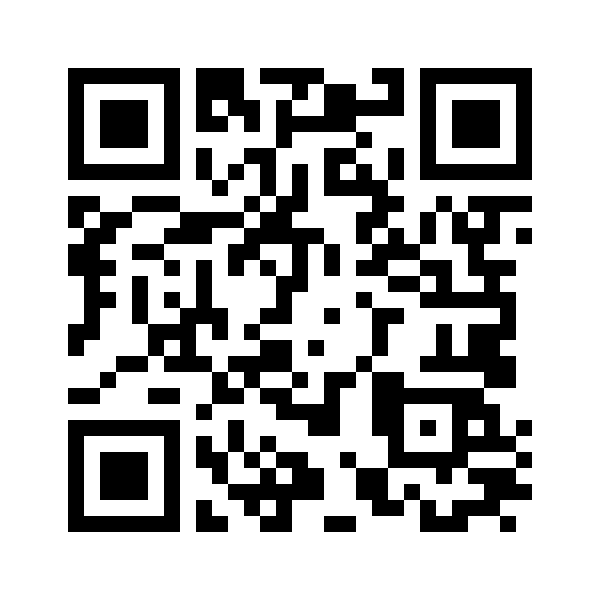

# HexaStay Admin – 호텔 관리 대시보드

<!-- 클릭 가능한 대표 이미지 (데모 링크로 이동) -->

  

---

> ℹ️ **Tip:** 새 탭에서 열려면 **Ctrl/Cmd + 클릭** 또는 **마우스 가운데 버튼**을 사용하세요.  
> ⚠️ **주의:** 실제 운영 환경 관리자 계정(ID/PW)은 보안상 공개하지 않습니다.

## 🔗 빠른 링크 (Quick Links)

### 🌐 메인 도메인
[**wooriproject.iptime.org:9002**](http://wooriproject.iptime.org:9002)

> 🟢 **로그인 정보**  
> ### **ID:** `gimdPfud@gmail.com`  
> ### **PW:** `030111`  
> **권한:** 관리자 ERP (읽기 / 편집 / 시스템 권한)

---

### 🔑 QR 인증 페이지 (고객용)
[**wooriproject.iptime.org:9002/qr/4**](http://wooriproject.iptime.org:9002/qr/4)  

> ### 🔵 **접속 암호:** `7284`

---

### 📂 프로젝트 리포지토리
[**GitHub – information_portfolio**](https://github.com/WhiteSnake-MrBBoo/information_portfolio)

---

## 🧭 개요
Spring Boot 3.4 + Thymeleaf + MariaDB 기반의 **호텔 관리 관리자 대시보드**입니다.  
객실/회원/예약 통합 관리, **QR 인증 & 이메일 발송 자동화**, 상태별 룸 리스트, 모달 기반 수정, 공통 템플릿 재사용을 통해 **운영 효율과 유지보수성**을 동시에 향상했습니다.

**문제 → 접근 → 성과**
- **문제:** 예약/회원/객실 관리가 흩어져 있고, 수동 알림/인증으로 리드타임이 길다.  
- **접근:** 모듈화된 CRUD + 공통 UI(공통 `roomlist.html`) + **QR/메일 자동화** + **WebSocket 양방향 갱신**.  
- **성과:** 예약·수정·알림의 단계 시간을 단축, **프론트 재사용성↑**, 운영 피로도↓.

---

## 🧩 핵심 기능
- **객실/회원/예약 CRUD** + 상태별 리스트(체크인/체크아웃/표시/숨김)
- **QR 인증** & **이메일 발송**(예약 생성 시 자동 본문: 회원명/체크인·아웃/룸 비밀번호/QR 링크)
- **모달 기반 검색·수정** (HotelRoom 이미지/메타 포함, `@Query` + Service(ModelMapper) + JSON 응답)
- **공통 템플릿 재사용**: 하나의 `roomlist.html`로 경로별/조건별 리스트 출력
- **예외 메시지의 UI 전달**: 사용자 가시성 강화
- **매출 분석 및 매출 데이터 EXCEL 데이터 다운로드 가능

---

## 📱 객실 이용고객 모바일·QR 전용 섹션

  <!-- QR 이미지(샘플): 클릭 시 QR URL로 이동 -->
  

 
- **QR 링크 - 객실이용고객의 경로**: http://wooriproject.iptime.org:9002/qr/4 
- ## **QR 링크 비밀번호**:   `7284`
> 모바일로 QR 접속시 간혹 에러뜰수도 있으나 되돌리기후 다시 QR 암호 7284로 접속시 모바일 페이지 접근 가능 

> 모바일 최적화된 **QR 인증 페이지**를 제공하며, 링크는 만료 가능한 **서명 토큰/단기 PIN**으로 보호됩니다.

---

## 🔄 실시간 & 고객 서비스
- **WebSocket 양방향 연동**
  - 체크인/체크아웃/상태 변경 시 대시보드 카드/테이블이 **실시간 갱신**
  - 룸서비스 주문시 호텔 매니저 관리자 및 객식 이용고객의 쌍방향 메시지 전달  
  - 관리자 간 동시 편집 충돌을 줄이고, 현장 대응 속도 향상
- **이메일 기반 고객 서비스**  
  - 예약 생성/수정 시 자동 메일 발송(회원명, 체크인/체크아웃, 룸 비번, **QR 인증 링크**)  
  - 템플릿 기반 다국어(예: KO/EN) 확장 용이

---

## 🤖 AI 자동화(옵션 기능)
- **예약 확인/변경 요청 요약**: 고객 자유서술 요청을 요약하여 **일정/필드 자동 채움** 제안  
- **메뉴 추천/장소 추천 분석**: 시스템안에 DB정보를 바탕으로 분석 / CS 우선순위 결정  

> *AI 기능은 추적 가능한 로그/실패 시나리오를 함께 설계하여 운영 신뢰성을 확보했습니다.*

---

## 🏗 아키텍처
- **Backend:** Spring Boot 3.4, JDK 21, ModelMapper, JPA, MariaDB, AWS  
- **Frontend:** Thymeleaf, Bootstrap 5, HTML5/CSS3/JS  
- **Integration:** SMTP(메일), WebSocket(대시보드 실시간), AI Inference API(Google Gemini)

